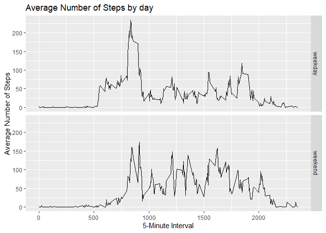

## Loading the packages

```r
library(data.table)
library(ggplot2)
library(dplyr)
```


## Loading and preprocessing the data

```r
unzip("activity.zip", exdir = "data")
activity <- data.table::fread("data/activity.csv")
activity$date <- as.POSIXct(activity$date, format = "%Y-%m-%d")
```


## What is mean total number of steps taken per day?  

1. Calculate the total number of steps taken per day  

```r
total_steps <- activity %>%
        group_by(date) %>%
        summarise(total = sum(steps, na.rm = FALSE))
head(total_steps, 10)
```

```
## # A tibble: 10 x 2
##    date                total
##    <dttm>              <int>
##  1 2012-10-01 00:00:00    NA
##  2 2012-10-02 00:00:00   126
##  3 2012-10-03 00:00:00 11352
##  4 2012-10-04 00:00:00 12116
##  5 2012-10-05 00:00:00 13294
##  6 2012-10-06 00:00:00 15420
##  7 2012-10-07 00:00:00 11015
##  8 2012-10-08 00:00:00    NA
##  9 2012-10-09 00:00:00 12811
## 10 2012-10-10 00:00:00  9900
```

2. Make a histogram of the total number of steps taken each day  

```r
ggplot(total_steps, aes(total)) +
        geom_histogram() +
        labs(x = "Total steps", y = "Counts"
                , title = "Histogram of the total number of steps")
```

<!-- -->

3. Calculate and report the mean and median of the total number of steps taken per day  

```r
mean1 <- mean(total_steps$total, na.rm = TRUE)
median1 <- median(total_steps$total, na.rm = TRUE)
mean1
```

```
## [1] 10766.19
```

```r
median1
```

```
## [1] 10765
```

The mean of the total number of steps taken per day is 10766.19, and the median is 10765.


## What is the average daily activity pattern?  

1. Make a time series plot of the 5-minute interval (x-axis) and the average number of steps taken, averaged across all days (y-axis)  

```r
mean_steps <- group_by(activity, interval) %>% 
        summarise(mean = mean(steps, na.rm = TRUE))

ggplot(mean_steps, aes(x = interval, y = mean)) +
        geom_line() +
        labs(x = "5-Minute Interval", y = "Average Number of Steps"
                , title = "Time Series Plot")
```

<!-- -->

2. Which 5-minute interval, on average across all the days in the dataset, contains the maximum number of steps?  

```r
max_interval <- mean_steps[which.max(mean_steps$mean), ]$interval
max_interval
```

```
## [1] 835
```

The 5-minute interval which has the maximum number of steps on average is 835.  


## Imputing missing values  

1. Calculate and report the total number of missing values in the dataset  

```r
nas <- sum(is.na(activity$steps))
nas
```

```
## [1] 2304
```

The total number of missing values is 2304.  

2. Devise a strategy for filling in all of the missing values in the dataset.  
* I am going to use the mean value for that 5-minute interval.  
3. Create a new dataset that is equal to the original dataset but with the missing data filled in.  


```r
activity_na <- activity[is.na(activity$steps),]
activity_value <- activity[!is.na(activity$steps),]
activity_na$steps <- rep(mean_steps$mean, 8)
activity_filled <- arrange(rbind(activity_na, activity_value), date, interval)
```

4. Make a histogram of the total number of steps taken each day and Calculate and report the mean and median total number of steps taken per day.  


```r
total_steps_filled <- activity_filled %>%
        group_by(date) %>%
        summarise(total = sum(steps, na.rm = TRUE))

ggplot(total_steps_filled, aes(total)) +
        geom_histogram() +
        labs(x = "Total steps", y = "Counts"
                , title = "Histogram of the total number of steps in the filled data")
```

<!-- -->

```r
mean2 <- mean(total_steps_filled$total)
median2 <- median(total_steps_filled$total)
mean2
```

```
## [1] 10766.19
```

```r
median2
```

```
## [1] 10766.19
```

The mean of the total number of steps taken per day is 10766.19, and the median is 10766.19.  

There is no significant difference because I used the mean of each interval for the missing values.  

## Are there differences in activity patterns between weekdays and weekends?  

1. Create a new factor variable in the dataset with two levels – “weekday” and “weekend” indicating whether a given date is a weekday or weekend day.  

```r
day <- ifelse(as.POSIXlt(activity$date)$wday %in% c(1:5), "weekday", "weekend")
activity_day <- activity
activity_day$day <- day
```

2. Make a panel plot containing a time series plot of the 5-minute interval (x-axis) and the average number of steps taken, averaged across all weekday days or weekend days (y-axis).  

```r
activity_day_grouped <- activity_day %>%
        group_by(day, interval) %>%
        summarise(mean=mean(steps, na.rm=TRUE))
ggplot(activity_day_grouped, aes(x=interval, y=mean)) +
        geom_line() +
        facet_grid(day~.) +
        labs(x = "5-Minute Interval", y = "Average Number of Steps"
                , title = "Average Number of Steps by day")
```

<!-- -->
